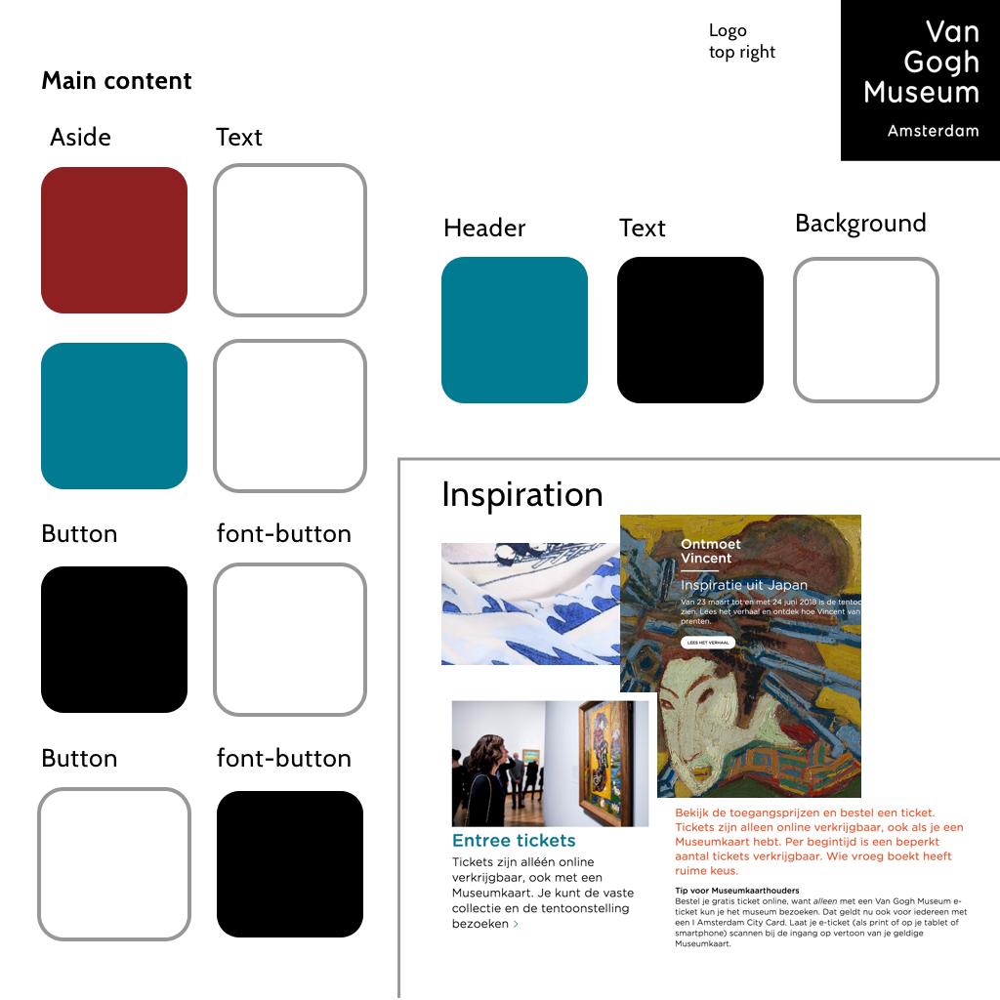

# van Gogh museum - Live visit

## User stories
* Als bezoeker van het museum wil ik mijn bezoek kunnen aansluiten op mijn persoonlijke voorkeuren en interesses, maar ik neem graag het advies van het VGM mee in mijn keuzes.

* _Als Programmamanager Multimedia van het Van Gogh Museum wil ik een onderbouwde (user centered + data driven design) keuze kunnen maken voor de (door)ontwikkeling van een gepersonaliseerde tour._

## Functionele eisen:
- [ ] Volledig doorklikbare interface
- [ ] UI is professioneel vormgegeven (in huisstijl VGM)
- [ ] Interface functioneert snel (zonder voor gebruiker waarneembare vertraging)
- [ ] Alle data van alle (test)sessies wordt opgeslagen.
- [ ] Op basis van de data worden een (beperkt) aantal conclusies getrokken en
gepresenteerd die als input voor doorontwikkelin(srichting) kunnen dienen.

# Van Gogh museum huisstijl

### website

This is a roughly sketch to for the styleguide the font is a custom made font so it's not on here. This is more as an example.

### VGM tour

The tour has a drasticly different style instead of the website. It isn't confusing and it sure is simplistic. But it could be more in the style of the website. This could make it for the user a bit easier.

- [x] This should be tested
